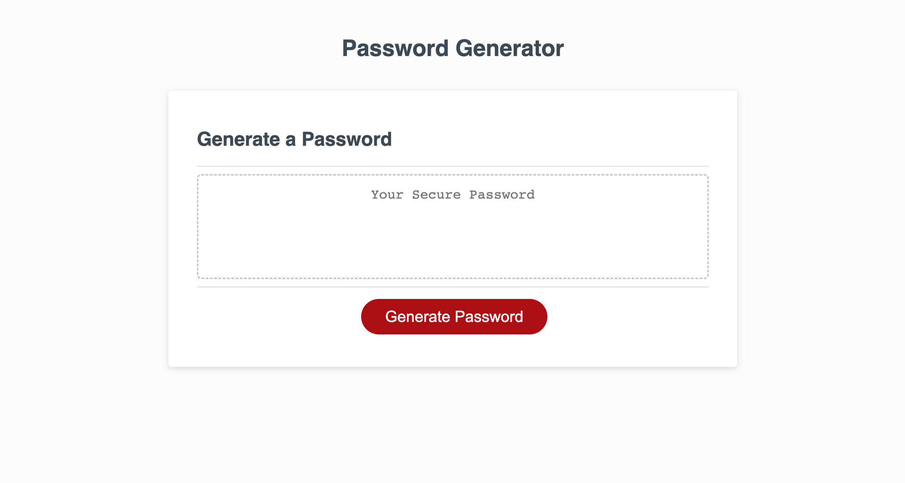
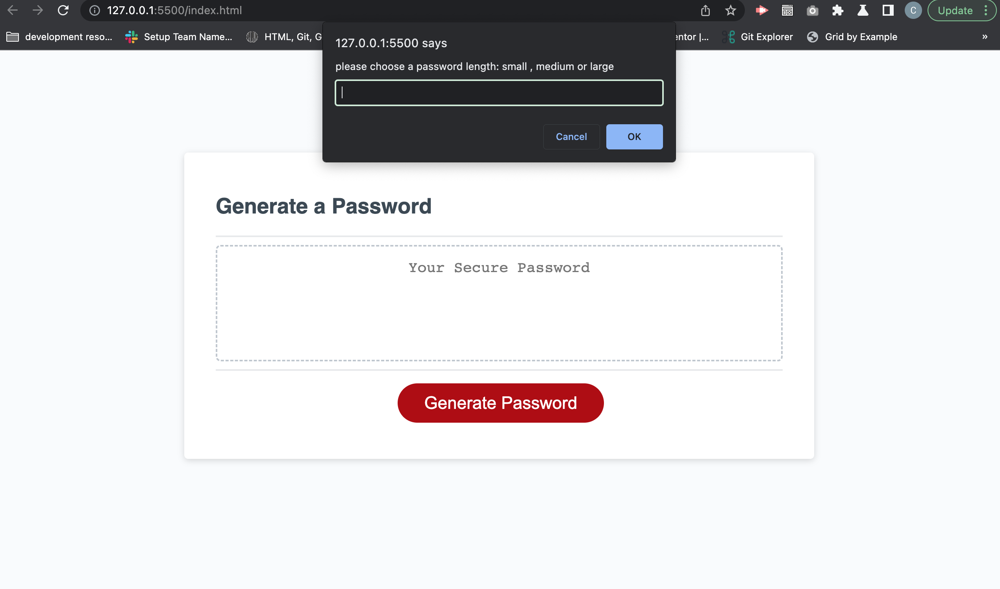
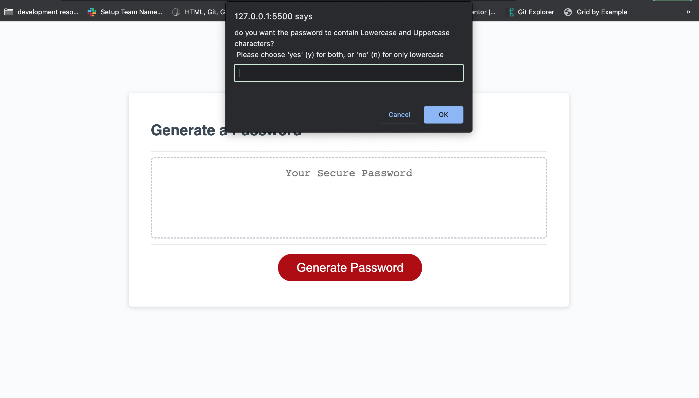
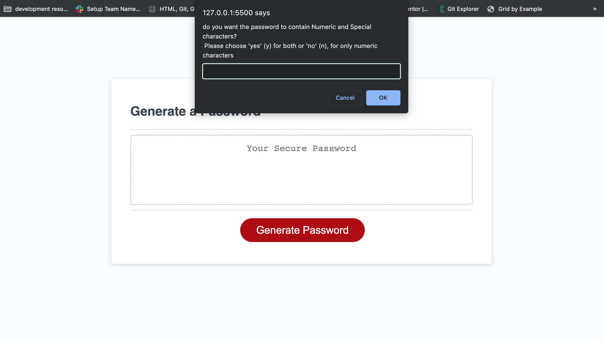
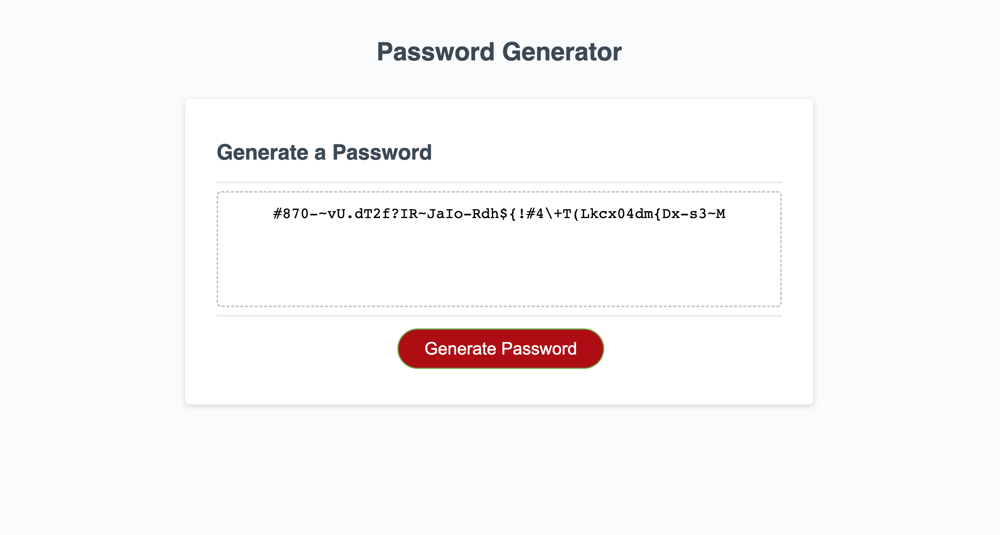

# password-generator
This repo contains the files and relevant material needed for my week 5 challenge set by my front end web development bootcamp.

## Description

In this challenge i had to use Javascript to create a random password generator. In the starter code there were arrays provided that contained different type of data that i could use(numerical characters, special characters, uppercase characters and lowercase characters);

Using these arrays i had to prompt the user to choose a password length between 10 - 64, and also prompt them to see if what characters they wanted the password to contain.

To start, i wrote out my pseudocode for how i would approach the take - firstly i wanted to prompt the user to choose if they wanted their password length to be small, medium or large. This was the best way i could think of to do this in the beginning.

Secondly i decided that i would ask the user if they wanted to use a mixture of uppercases and lower case characters or only one kind (i choose which kind the default would be as i wasnt sure which would be the best way to approach providing all the perimeters to user for possible choices. - i repeated this for the numerical and special characters. 

As i was writing the code i realised that i was maybe making it more complicated than it needed to be and could probably find an easier way to complete the task but i wanted to create a challenge for myself and see if i could work it out. I did realised the my naming conventions were definately not the best and it lead to some confusion but now i know how to learn from this for when i complete future tasks - i also want to recomplete this task at a later date to try another way to complete the task. 

while coming to the end of the task i had difficulty with getting the generated password to print in the HTML box and i realsied it was due to my naming conventions but i was able to solve this problem. I also had some difficultly with understanding when to use 'return'.

I also had to rework some of the starter code in this project as i got confused with the flow of the javascript.

## Table of Contents

- [Installation](#installation)
- [Screenshots](#screenshots)
- [License](#license)

## Installation

No need to install anything to view this project; you can view it [here]()

## Screenshots

## License

MIT licence

---

© 2022 edX Boot Camps LLC. Confidential and Proprietary. All Rights Reserved.

